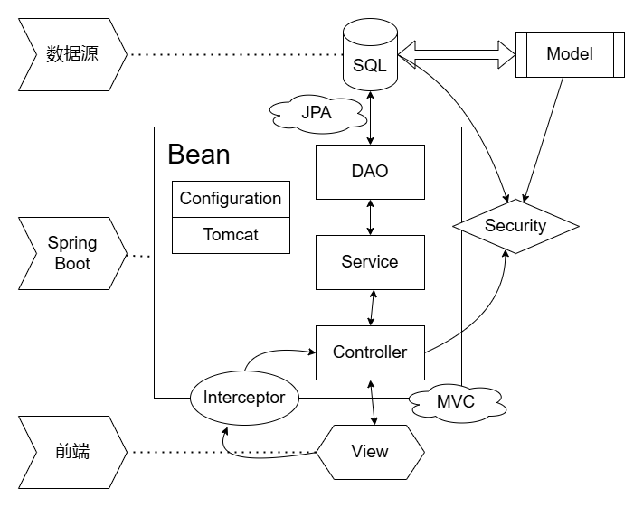
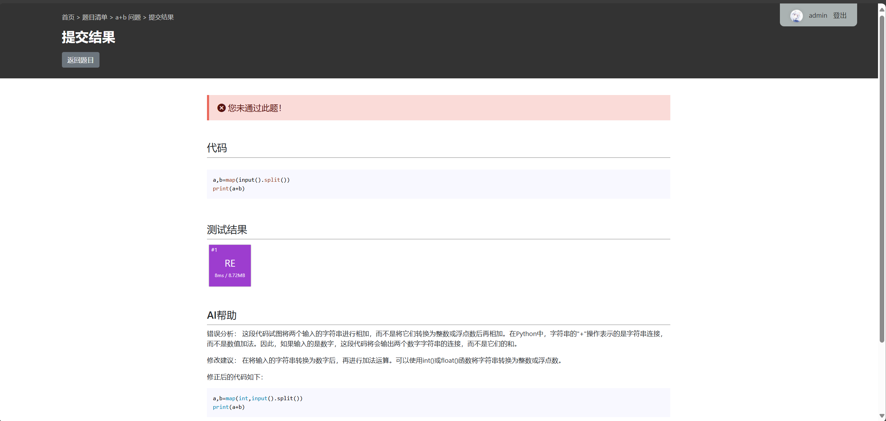

# Java程序设计期末作业——OICraft

## 项目简介

SpringBoot 是一个基于 Spring 的轻量级框架，它可以用来快速开发基于 Java 的 Web 应用程序。

~~由于长期苦于 OpenJudge 和编程网格的网页界面~~，本次课程设计作业依托于 SpringBoot 架构开发了一款在线代码测评网站——OICraft。

请仔细阅读本文档的注意事项，尤其是 **<font color=red>红色字体</font>** 内容

---

## 项目分工

- 原梓轩 2200010825：代码大框架设计，前端交互页面以及 MVC 框架搭建，运行于本机的代码检查实现，大批代码重构与优化。
- 陈润璘 2200010848：SQL 数据库的设计与 JPA 实现，运行于 Docker 容器的代码检查实现，Web 和 NAS 服务器提供与维护，AI 接口提供和实现。
- 任子博 2200010626：部分核心业务逻辑与后端代码编写，必要的工具类支持。

---

## 使用方法

OICraft 所用服务器是 SpringBoot 内置的 Tomcat 服务器（在本机运行），数据库 MySQL 来自于远程的阿里云服务器，采用了 JPA 框架来操作数据库。前端页面采用了 Thymeleaf 模板引擎。

欢迎直接使用我们在网页端部署的服务器：<http://123.56.220.173>，服务器的内核是配置 Docker 环境的 Linux。然而，服务器和数据库在一个月左右就会过期关闭。

> <b><font color="red">务必将本项目放在英文目录文件夹下，否则可能不能正常评测代码！目前仅支持 Windows 和 Linux 平台。</font></b> 如果在测试当中遇到问题，可以用微信联系。

- 下载项目源代码后，使用 IntelliJ IDEA 作为项目打开。
- 点击 `pom.xml` 文件，刷新导入 Maven 依赖。
- 打开 `resources` 文件夹，在 `application.properties` 文件中配置数据库连接信息和邮箱信息。在 `ai.properties` 文件中配置科大讯飞 AI 的 api-key，如果没有，暂时跳过这一步。
- 如果电脑上安装了 Docker，可以使用 Docker 容器运行代码检查以免受到提交的恶意代码的攻击，否则将在本机运行代码检查。如果要强制禁用 Docker，请在运行前将 `USE_DOCKER` 环境变量设置为 `false`。
    > 如果使用 Docker，第一次运行时可能要用几分钟时间下载镜像和构建容器。<font color=red>建议手动在构建，不要自动构建。</font>构建目录在 `resources/scripts/docker` 下的四个目录，分别构建命名为 `code-checker-java/c/cpp/python` 的镜像。
- 如果在 `properties` 配置好了，运行 `OICraftApplication.java` 启动项目；如果没有，可以用我们提供的 `run.sh`（Linux) 或 `run.bat`（Windows）来启动项目；或者在 IDEA 的项目配置中录入其内的环境变量信息，这样在之后运行时只需启动 `OICraftApplication.java`即可。
  > **<font color=red>重要警告：这两个脚本内部的环境变量配置是敏感信息，请勿对外公布！</font>** 它们没有被上传到 Github。
- 启动后，如果控制台出现了 OICraft 的 Logo，并随后出现了 SpringBoot 的运行日志 `Completed initialization in xxx ms`，说明项目启动成功。（注意：由于要链接数据库，需要保持较好的网络连接）
- 在浏览器中输入 `http://localhost` 即可访问网站。如果运行失败显示端口 80 被占用，请在 `resources/application.properties` 配置 `server.port` 空闲端口，并访问对应端口号 `http://localhost:xxx` 即可。
- 在网站的右上角登录账户，如果没有账户，可以点击注册按钮注册账户。（<font color=green>为了更好地展示所有功能，可以登录事先的管理员账户：Java，密码：2024</font>）

本项目已在 [GitHub](https://github.com/LeoDreamer2004/OICraft) 上开源。

---

## 基本功能

### 代码评测

本项目是一个在线代码测评网站，用户可以在网站上提交代码，网站会自动编译运行代码，并返回运行结果。目前支持的语言有 Java、C、C++、Python。

### 用户管理

依托于 SpringSecurity 框架，本项目实现了用户的注册、登录、登出功能。用户可以在网站上注册账号，登录后可以提交代码，查看提交记录等。对于某些网页，需要登录后才能访问。

我们为用户提供了个性化档案的功能。用户可以在个人档案中查看自己的提交记录，签到记录，积分等。用户还可以设置个性签名和上传自己的头像，头像会显示在个人档案中。


我们设置了管理员系统。管理员可以任意编辑问题，查看用户提交记录等。同时，我们还提供了站点管理的操作页面。管理员可以编辑其他用户的权限，或者对用户进行删除。

我们还将用户根据积分分成了若干用户组。从低到高依次为 `BEGINNER`, `INTERMEDIATE`, `ADVANCED`, `EXPERT`。积分可以通过每日的签到系统获得，也可以通过提交代码获得。不同用户组的用户名称会被着以不同的颜色。

我们还设置了绑定邮箱的功能。用户可以绑定邮箱，绑定邮箱后可以通过邮箱找回密码。通过使用一个公共邮箱，生成一个 UUID 验证码，发送到用户的邮箱，用户输入验证码即可完成验证或者找回密码。

### 算法测试

在题目列表中陈列着数据库当中所有的问题。我们提供了问题搜索功能，用户可以通过关键字搜索问题。

任何已登录用户都可以上传问题，但只有出题者或管理员可以在网站上编辑和删除问题。问题的内容包括题目描述、输入输出样例、题目难度等。用户可以在网站上查看问题，提交代码，查看提交记录。

> 注：我们对网页端渲染提供了 markdown, html 和相应的 KaTeX 支持，用户可以在题目描述中使用 markdown 或 html 语法。允许用户下载题目的 markdown 版本。
>
> 我们从 OpenJudge 上用爬虫爬取了一百道题左右，不过没有测试点。

关于编辑测试点，我们提供了两种方式。用户可以在网站上上传测试点文件，也可以手动输入测试点。我们还提供了测试点的下载功能，以满足备份等等的需要。文件的具体格式在网页上有详细说明。

### 讨论区

用户可以在讨论区发帖，回帖。帖子的内容包括帖子的标题、内容、作者等。用户可以在网站上查看帖子，回复帖子。与前面一样，我们也提供了对 markdown 和 html 语法的支持。

---

## 项目结构



由于项目较大，文件过多，UML图太复杂不能很好地反映项目结构，这里从整体上介绍项目分为的五个主要层次：

- **Model**：模型层，用于定义数据结构，与数据库中的表一一对应。
- **DAO**：数据访问层，是对 SQL 语言的包装，这里用 JPA 对数据进行增删改查，直接与数据库交互。
- **Service**：服务层，用于处理业务逻辑，例如测试代码。调用 DAO 层处理数据，并返回结果给 Controller。
- **Controller**：控制层，是 MVC 架构的重点。用于处理用户请求，调用 Service 层处理业务逻辑，并返回结果给用户。此外，还有拦截器 Interceptor 用于拦截请求捕获必要的信息。
- **View**：前端页面，包括 HTML、CSS、JavaScript 等文件，依托于 bootstrap 样式和 Thymeleaf 模板引擎，给用户展示页面并直接与用户交互。

除此之外，还有：

- **Config**：配置类，包括对 Spring 的配置，对 SpringMVC 的配置和对 Spring Security 的配置。
- **Util**：工具类，包括一些工具方法，例如代码评测、网络爬虫、邮箱验证等等。

Spring 架构提供的 Bean 容器，可以自动扫描并加载这些层次的类，实现了解耦合，提高了代码的可维护性。

---

## 代码实现

既然结构已经分析好了，接下来自内向外分析一下代码实现的一些细节。

### 数据库设计（Model层）

我们设计了几个重要的模型：

- **用户(User)**：用户的信息。包括用户名、密码、邮箱、积分等。
- **题目(Problem)**：题目的信息。包括题目描述、输入输出样例、题目难度等。
- **提交(Submission)**：用户提交的代码。包括提交的代码、针对的问题、结果等。
- **输入输出对(IOPair)**：一个依赖于题目和提交的弱实体。包括输入输出样例、得分等。
- **测试点(Checkpoint)**：实际上是输入输出对-提交之间的多对多联系。
- **帖子(Post)**：针对某个问题在讨论区帖子。包括帖子的标题、内容、作者等。
- **评论(Comment)**：针对某个帖子的评论。包括评论的内容、作者等。

每个模型在数据库都有对应的表，表之间通过外键联系。

### 数据库访问（DAO层）

为了方便前后端工作的分离，我们把 DAO 层声明为若干个接口。这样，我们就可以在 Service 层或 Controller 层直接调用 DAO 层的方法，而不用关心具体的实现，就实现了数据访问层的解耦合。

#### JPA 框架和 Hibernate

我们通过 JPA 框架来操作数据库。通过在模型类上添加注解，可以自动生成数据库表。同时，我们还可以通过在接口中定义方法，自动生成 SQL 语句，同时也可以定义自己的 SQL 语句对应的方法。

```java
public interface UserRepository extends CrudRepository<User, Integer> {
    @Query("select u from User u where u.name = ?1")
    List<User> findByName(String name);
}
```

这样，Hibernate 框架就会自动生成相应的 SQL 语句，我们就可以直接调用继承自 `CrudRepository` 的方法，实现对数据库的基本增删改查。 同时，这样会自动将 `UserRepository` 定义成一个 Bean，方便我们在 DAO 层进一步封装时使用自动装配。

#### DAO 层的设计

我们把有关用户、题目、提交、测试的操作分别封装在了若干个接口中。这样，我们就可以在 Service 层直接调用接口的方法，而不用关心具体的实现。

作为对 `Repository` 的进一步封装，我们为其它两层的需求实现了更加具体的方法。同时，我们还实现了一些自动化的数据更新，例如用户做对一道题目时自动增加积分，用户签到时自动增加积分以及根据用户的积分自动更新用户的级别。

同时，由于数据库中的数据约束导致直接删除记录时可能出现异常，我们在实现删除操作时同时避免了这一点。例如，删除用户时，要把用户的提交和测试点都删除。但是，把用户的问题设置为 `null`，这表明用户已注销，但是问题依然会保留。

在建立 DAO 对象时，使用 Bean 容器自动装配 `@Autowired` 的方式，直接调用接口的方法即可。这样，我们就可以在不改变接口的情况下，更换具体的实现。

```java
public class UserService {
    private UserDao userDao;

    @Autowired
    public void setUserDao(UserDao userDao) {
        this.userDao = userDao;
    }
}
```

> 特别地，对于诸如用户头像这种大型二进制的数据存储，有两种办法：
>
> - 用 BLOB 类型直接存储在数据库中，但这时每次用户刷新网页请求时会造成大量的数据查询影响数据库性能
> - 存储在一个固定的 URL 中，这种方式对性能开销小
>
> 我们采用的是第二种方案。<font color=red>请注意：由于我们在前端网页显示头像是基于对 NAS 服务器文件外链的，所以在本地运行服务器时头像功能完全无效，如果想测试上传或修改头像，请在我们提供的 [网页服务器](http://123.56.220.173) 上编辑。</font>

### 业务逻辑（Service层）

和 DAO 层一样，我们也把 Service 层设计为若干个对外开放的接口和内部的实现。在对外开放后，使用自动装配生成对象，调用接口方法，实现解耦合。

#### 代码评测

我们的 `CodeChecker` 实际是一个抽象类，有本地运行和 Docker 容器的两种实现。在本地运行时，我们直接调用系统的编译器和运行器。在 Docker 容器中运行时，我们会先将代码上传到容器中，再调用容器中的编译器和运行器进行测试。使用工厂类来获取适配于本机的 `CodeChecker`。

用户提交代码后，为了处理并发，我们会在后台开启一个线程池，用于评测代码。每个代码提交（Submission）都会被放入一个子线程中，调用 `CodeChecker` 对相应问题的每个测试点（IOPair）进行评测（以下代码为节选）。

```java
public int testCode(User user, Problem problem, String code, String language) {
  //在线程池中开启一个子线程
  executorService.execute(() -> {
    CodeChecker codeChecker = CodeCheckerFactory.getCodeChecker();
    // 测试代码
    codeChecker.test();
    // 处理结果
  });
}
```

测试结束后，调用相应的 DAO 层方法，将结果存入数据库。我们采用 AOP 切片的方法，来监控程序运行的耗时性能。

#### 邮箱绑定

我们通过 Spring 架构下 `javamail` 包提供的邮件发送功能，使用网易 smtp 服务器来发送验证码邮件（以下代码为节选）。

```java
private JavaMailSender mailSender;

public void send(User user, String email) {
    //邮件创建与发送
    MimeMessageHelper helper = new MimeMessageHelper(mailMessage, false, "utf-8");
    helper.setTo(email);
    mailSender.send(mailMessage);
}
```

其中验证码使用 `UUID` 生成，保证了验证码的唯一性。

```java
String verificationCode = UUID.randomUUID().toString();
```

#### 测试点读取

我们通过 `java.util.zip` 包，实现了将测试点数据以zip文件的形式进行上传和下载。

```java
public int addIOPairByZip(InputStream fileStream, int problemId) throws IOException;
public InputStream getIOPairsStream(int problemId) throws IOException;
```

前者用于添加测试点。接收一个 zip 文件流，首先将其存放在本地。然后解压文件，按照扩展名将 IOPair 的数据读取出来，存入数据库，最后清除临时文件。后者用于下载测试点，接收一个问题的 id ，将该问题的所有测试点数据打包成 zip 文件流，返回给用户。

#### 签到

我们实现了用户的签到功能。

```java
public void checkIn(User user);
public boolean hasCheckedInToday(User user);
```

前者调用相关 DAO 在数据库中将该用户的签到状态设置为已签到，并增加积分，同时更新用户的签到时间。后者判断该用户今天是否已签到，每个用户每天只能签到一次。

#### 问题搜索

为了完成对题目清单中问题的模糊搜索，我们使用 `lucene` 库中的相关方法对问题进行索引，并对用户输入的查询进行分词。对二者进行匹配后按照标题权重大于描述的顺序将符合要求的题目返回（以下代码为节选）

```java
public List<T> search(String keyword) {
    // 获取所有元素
    // 解析文本
    String[] fields;
    MultiFieldQueryParser parser = new MultiFieldQueryParser(
            fields, new SmartChineseAnalyzer(), boosts);
    Query query;
    query = parser.parse(keyword);
    // 搜索结果
    IndexSearcher indexSearcher = new IndexSearcher(indexReader);
    TopDocs topDocs = indexSearcher.search(query, maxSearchResult);
}
```

#### AI查错

我们使用了~~白嫖的~~讯飞星火的 API 进行 AI 查错。如果某次提交没有通过，用户可以调用 AI 来分析代码中的错误。我们使用一个提示词模板来生成相应的问题，并调用 API 来获取结果。



#### 异常处理

我们按照 SpringBoot 推荐的方式，定义几个常见的全局异常，当 Service 层遇到问题时相应抛出，最后在前端进行控制管理（例如404页面或打印日志）。

这里我们主要定义了以下几类异常：

```java
public class NoAuthenticationError {
} // 无权限异常

public class AdminOperationError {
} // 管理员操作异常，是前者的子类

public class BadFileException {
} // 用户文件异常

public class CodeCheckerError {
} // 代码评测异常

public class EntityNotFoundException {
} // 实体未找到异常

public class UserNotLoggedInException {
} // 用户未登录异常

public class EmailVerificationError {
} // 邮箱验证异常
```

### 控制层（Controller层）

Controller 层是整个项目的入口，用于处理用户请求。我们通过注解 `@Controller` 来声明一个控制器。利用 `@GetMapping`
或 `@PostMapping` 来映射请求路径。

在我们的控制器实现中，方法可以接受以下两种参数：

- `@PathVariable` 注解，获取请求的路径参数。

    ```java
    @GetMapping("/your/url/path/{id}")
    public String getView(@PathVariable("id") int id);
    ```

- `@RequestParam` 注解，获取 URL 的参数。

    ```java
    @PostMapping("/your/url/path")
    public String postView(@RequestParam("name") String name);
    ```

随后返回以下三者之一：

- `ModelAndView` 对象，这个对象包含了视图的名称和数据。

    ```java
    @GetMapping("/your/url/path")
    public ModelAndView getView() {
        return new ModelAndView("local/path/to/view")
                .addObject("name", object);
    }
    ```

- `RedirectView` 对象，这个对象包含了重定向的路径。

    ```java
    @GetMapping("/your/url/path")
    public RedirectView redirect() {
        return new RedirectView("/redirect/url/path");
    }
    ```

- `ResponseEntity` 对象，这个对象包含了 HTTP 的响应。

    ```java
    @GetMapping("/your/url/path")
    public ResponseEntity<String> response() {
        return ResponseEntity.ok("response body");
    }
    ```

此外，我们设计了一个简单的拦截器，用于拦截请求，捕获必要的信息在拦截器中。这里我们在请求前后捕获当前的用户信息，随后把此用户作为 Object 插入到 `ModelAndView` 中，我们可以通过 `HttpServletRequest` 对象获取请求的信息。

```java
public class UserInfoInterceptor implements HandlerInterceptor {
    @Override
    public void postHandle(
            @NonNull HttpServletRequest request,
            @NonNull HttpServletResponse response,
            @NonNull Object handler,
            ModelAndView modelAndView
    ) {
        User user; // Get the user object from the request 
        modelAndView.addObject("user", user);
    }
}
```

建立之后，把拦截器加入到 MVC 的配置当中。

### 前端页面（View层）

前端页面是用户直接看到的页面，我们使用 Thymeleaf 模板引擎来渲染页面。Thymeleaf 是一个 Java 模板引擎，可以处理 HTML、XML、JavaScript、CSS、甚至纯文本。

- 在 Controller 层的 ModelAndView 对象中，我们可以通过 `addObject` 方法添加对象，然后在 HTML 页面中通过 `${}` 语法来获取对象的属性。

    ```html
    <p th:text="${user.name}"></p>
    ```

- 在 HTML 页面中，我们可以通过 `th:if` 和 `th:unless` 语法来控制元素的显示。

    ```html
    <div th:if="${user.isAdmin()}"></div>
    ```

- HTML 的超链接和表单提交，我们可以用 `@{/}` 语法来生成 URL。这样，我们就可以在页面上使用相对路径，而不用担心路径的变化。

    ```html
    <a href="@{/your/url/path}">Link</a>
    ```

- 为了提高代码复用性，可以使用 `th:replace` 语法来引入其他页面。

    ```html
    <link rel="stylesheet" th:replace="~{base :: baseStyle}">
    ```

### 用户管理（Spring Security）

我们使用 Spring Security 6 框架来实现用户的认证和授权。Spring Security 是一个功能强大且高度可定制的身份验证和访问控制框架。

首先要让用户模型实现 `UserDetails` 接口，表明让 Spring Security 使用这个类作为用户。同时让 `UserService` 实现 `UserDetailsService` 接口，让 Spring Security 能找到对应的用户信息。

我们创建一个 Spring Security 配置类，编写其过滤器链，并利用注解将其自动装配在配置用户的认证和授权。

```java
@Configuration
@EnableWebSecurity
@EnableMethodSecurity
public class WebSecurityConfig {
    @Bean
    public SecurityFilterChain filterChain(HttpSecurity http) throws Exception;
}
```

这里充分体现了流式编程的设计思想，我们可以通过链式调用的方式，一步一步配置 Spring Security 的功能。

- `authorizeHttpRequests` 配置 URL 的访问权限。例如，对于 `admin/**` 下的 URL，只有管理员才能访问。某些网页，必须登录之后才可访问。
- `csrf` 配置 CSRF 保护。CSRF（跨站请求伪造）是一种网络攻击方式，Spring Security 提供了 CSRF 保护。
- `formLogin` 配置登录页面。可以自定义用户登录页面的 URL。
- `logout` 配置登出页面。可以自定义用户登出页面的 URL。
- `rememberMe` 配置记住我功能。利用浏览器的 Cookie 机制，实现用户的自动登录。

另外，考虑到要兼顾数据库的安全性，我们使用了 BCrypt 加密算法对对用户密码进行了加密。

```java
@Bean
public PasswordEncoder passwordEncoder() {
  return new BCryptPasswordEncoder();
}
```

---

## 扩展展望

一些可能的扩展和改进：

- 代码评测功能的优化，例如支持更多语言，支持更多测试点，支持更多的编译器和运行环境。
- 用户管理功能的优化，例如支持更多的用户操作，支持更多的用户信息。也许可以设计用户关注和私信聊天的功能。
- 问题管理优化，例如设计题目的标签和分类。
- 网站的美化，例如设计更多的动画效果，更多的交互效果。当然，这方面属于前端的工作，不是本次 Java 课程设计的重点。
- 性能优化，例如对数据库的查询进行优化，对代码评测的速度进行优化，以及对并发请求的处理等等，这方面需要更多的测试和实验。

---

## 项目总结

在这次实习作业当中，我们依托于 SpringBoot 框架自主设计了一个代码评测网站，并实现了诸多此类网站应有的实际功能。

- 我们利用 Spring 的 AOP，IOC 和 DI 三大特点降低了代码耦合度，提高了代码的可维护性。同时，注解开发的方式和约定大于配置的原则，很大地提高了我们的开发效率。

- 我们使用一般项目常用的设计模式，例如 MVC 模式，DAO 模式，Service 模式等。分层次的设计便于我们更好地分工合作，使得我们在维护代码 Git 时更加方便。

- 我们了解了很多服务器的使用方式，并对 ssh 有了一定的认识，对 Web 服务器有了一次深入的体验。

- 我们学习了使用 maven 来管理项目和第三方依赖，合理地调用第三方依赖可以避免重复造轮子，提高代码效率。

- 我们学习了如何使用 Spring Security 来实现用户的认证和授权，如何使用 Thymeleaf 模板引擎来渲染页面，也学习了如何使用 JPA 框架来操作数据库。

总之，这次实习作业让我们对 SpringBoot 框架有了更深入的了解，也让我们对 Java Web 开发有了更多的实践经验。希望我们的 OICraft 项目能够为大家提供一些参考。
