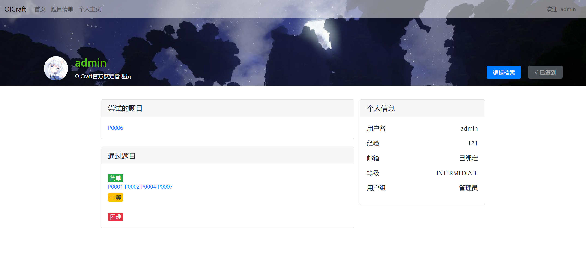

# Java程序设计期末作业——OICraft

## 项目简介

SpringBoot是一个基于Spring的轻量级框架，它可以用来快速开发基于Java的Web应用程序。

~~由于长期苦于Openjudge和编程网格的网页界面~~，本次课程设计作业依托于 SpringBoot 架构开发了一款在线代码测评网站——OICraft。

---

## 项目分工

- 原梓轩 2200010825：前端交互页面以及 MVC 框架搭建
- 陈润璘 2200010848：SQL 数据库的设计与 JDBA 实现
- 任子博 2200010626：业务逻辑与后端代码编写

---

## 使用方法

OICraft 所用服务器是 SpringBoot 内置的 Tomcat 服务器（在本机运行），数据库 MySQL 来自于远程的阿里云服务器，采用了 JPA
框架来操作数据库。前端页面采用了 Thymeleaf 模板引擎。

> <b><font color="red">请注意，务必将本项目放在英文目录文件夹下，否则可能不能正常评测代码！</font></b>

- 下载项目源代码后，使用 IntelliJ IDEA 作为项目打开。
- 点击 `pom.xml` 文件，刷新导入 Maven 依赖。
- 在 `resources/application.properties` 文件中配置数据库连接信息和邮箱信息。这里我们已经配好了远程阿里云数据库和公用邮箱。
- 运行 `OICraftApplication.java` 启动项目。如果控制台出现了 OICraft 的 Logo，并随后出现了 SpringBoot
  的运行日志 `Completed initialization in xxx ms`，说明项目启动成功。（注意：由于要链接数据库，需要保持较好的网络连接）
- 在浏览器中输入 `http://localhost:8080` 即可访问网站。

本项目已在 [GitHub](https://github.com/LeoDreamer2004/OICraft) 上开源。

---

## 基本功能

### 代码评测

本项目是一个在线代码测评网站，用户可以在网站上提交代码，网站会自动编译运行代码，并返回运行结果。目前支持的语言有Java、C、C++、Python（实际上，这里的代码是在本机运行的，所以本机需要有相应的编译器和开发环境）。

### 用户管理



依托于 SpringSecurity 框架，本项目实现了用户的注册、登录、登出功能。用户可以在网站上注册账号，登录后可以提交代码，查看提交记录等。对于某些网页，需要登录后才能访问。

我们设置了管理员系统。管理员可以任意编辑问题，查看用户提交记录等。同时，我们还提供了站点管理的操作页面。管理员可以编辑其他用户的权限，或者对用户进行删除。

我们还将用户根据积分分成了若干用户组。从低到高依次为 `BEGINNER`, `INTERMEDIATE`, `ADVANCED`, `EXPERT`
。积分可以通过每日的签到系统获得，也可以通过提交代码获得。不同用户组的用户名称会被着以不同的颜色。

我们还设置了绑定邮箱的功能。用户可以绑定邮箱，绑定邮箱后可以通过邮箱找回密码。通过使用一个公共邮箱，生成一个 UUID
验证码，发送到用户的邮箱，用户输入验证码即可完成验证或者找回密码。

### 问题管理

在题目列表中陈列着数据库当中所有的问题。我们提供了问题搜索功能，用户可以通过关键字搜索问题。

任何已登录用户都可以上传问题，但只有出题者或管理员可以在网站上编辑和删除问题。问题的内容包括题目描述、输入输出样例、题目难度等。用户可以在网站上查看问题，提交代码，查看提交记录。

> 注：我们对网页端渲染提供了 markdown 和相应的 KaTeX 支持，用户可以在题目描述中使用 markdown 语法。允许用户下载题目的
> markdown 版本。

关于编辑测试点，我们提供了两种方式。用户可以在网站上上传测试点文件，也可以手动输入测试点。我们还提供了测试点的下载功能，以满足备份等等的需要。文件的具体格式在网页上有详细说明。

---

## 项目结构


从整体上，项目大致分为五个主要层次：

- **Model**：模型层，用于定义数据结构，与数据库中的表一一对应。
- **DAO**：数据访问层，是对 SQL 语言的包装，这里用 JPA 对数据进行增删改查，直接与数据库交互。
- **Service**：服务层，用于处理业务逻辑，例如测试代码。调用 DAO 层处理数据，并返回结果给 Controller。
- **Controller**：控制层，是 MVC 架构的重点。用于处理用户请求，调用 Service 和 DAO 层处理业务逻辑，并返回结果给用户。此外，还有拦截器
  Interceptor 用于拦截请求捕获必要的信息。
- **View**：前端页面，包括 HTML、CSS、JavaScript 等文件，依托于 bootstrap 样式和 Thymeleaf 模板引擎，给用户展示页面并直接与用户交互。

Spring架构提供的Bean容器，可以自动扫描并加载这些层次的类，实现了解耦合，提高了代码的可维护性。

---

## 代码实现

既然结构已经分析好了，接下来自内向外分析一下代码实现的一些细节。

### 数据库设计（Model层）

我们设计了五个重要的模型：

- **用户(User)**：用户的信息。包括用户名、密码、邮箱、积分等。
- **题目(Problem)**：题目的信息。包括题目描述、输入输出样例、题目难度等。
- **提交(Submission)**：用户提交的代码。包括提交的代码、针对的问题、结果等。
- **输入输出对(IOpair)**：一个依赖于题目和提交的弱实体。包括输入输出样例、得分等。
- **测试点(Checkpoint)**：实际上是输入输出对-提交之间的多对多联系。

每个模型在数据库都有对应的表，表之间通过外键联系。

### 数据库访问（DAO层）

为了方便前后端工作的分离，我们把 DAO 层声明为若干个接口。这样，我们就可以在 Service 层或 Controller 层直接调用 DAO
层的方法，而不用关心具体的实现，就实现了数据访问层的解耦合。

我们通过 JPA 框架来操作数据库。通过在模型类上添加注解，可以自动生成数据库表。同时，我们还可以通过在接口中定义方法，自动生成
SQL 语句。

TODO: 陈润璘（更多有关Repository的内容）

在建立 DAO 对象时，使用 Bean 容器自动装配 `@Autowired` 的方式，直接调用接口的方法即可。这样，我们就可以在不改变接口的情况下，更换具体的实现。

```java
public class UserService {
    private UserDao userDao;

    @Autowired
    public void setUserDao(UserDao userDao) {
        this.userDao = userDao;
    }
}
```

### 业务逻辑（Service层）

和 DAO 层一样，我们也把 Service 层设计为若干个对外开放的接口和内部的实现。在对外开放后，使用自动装配生成对象，调用接口方法，实现解耦合。

#### 代码评测

用户提交代码后，为了处理并发，我们会在后台开启一个线程池，用于评测代码。

```java
private final ExecutorService executorService = Executors.newCachedThreadPool();
```

每个代码提交（Submission）都会被放入一个子线程中，调用`codeChecker`对相应问题的每个测试点（IOPair）进行评测。

```java
public int testCode(User user, Problem problem, String code, String language) {
  ...
    //在线程池中开启一个子线程
    executorService.execute(() -> {
        while (...){
            CodeChecker codeChecker = new CodeChecker();
            // 测试代码
            try {
                codeChecker.setIO(code, language, ioPair.getInput(), ioPair.getOutput(), id)
                        .setLimit(problem.getTimeLimit(), problem.getMemoryLimit())
                        .test(!iterator.hasNext());
            } 
      ...
        }
    };
}
```

测试结束后，调用相应的DAO层方法，将结果存入数据库.

#### 邮箱绑定

我们通过Spring架构下`springframework.mail.javamail`提供的邮件发送功能，使用网易smtp服务器来发送验证码邮件。

```java
private JavaMailSender mailSender;

public void sendVerificationCode(User user, String email) {
  ...
    //邮件创建与发送
    MimeMessageHelper helper = new MimeMessageHelper(mailMessage, false, "utf-8");
    mailMessage.setContent(htmlMsg, "text/html");
    helper.setTo(email);
    helper.setSubject("Your OICraft verification code");
    helper.setFrom("oicraft2024@163.com");
    mailSender.send(mailMessage);
  ...
}
```

其中验证码使用`UUID`生成，保证了验证码的唯一性。

```java
String verificationCode = UUID.randomUUID().toString();
```

#### 测试点读取

我们通过`java.util.zip`包，实现了将测试点数据以zip文件的形式进行上传和下载。

```java
public int addIOPairByZip(InputStream fileStream, int problemId) throws IOException;
```

此方法接收一个zip文件流，首先将其存放在本地。然后解压文件，按照扩展名将IOPair的数据读取出来，存入数据库，最后清除临时文件。

```java
public InputStream getIOPairsStream(int problemId) throws IOException;
```

此方法接收一个问题的id，将该问题的所有测试点数据打包成zip文件流，返回给用户。

#### 签到

（签到机制）
通过以下两个方法，我们实现了用户的签到功能。

```java
public void checkIn(User user);
```

此方法接收一个用户对象，调用相关DAO在数据库中将该用户的签到状态设置为已签到，并增加积分，同时更新用户的签到时间。

```java
public boolean hasCheckedInToday(User user);
```

此方法接收一个用户对象，判断该用户今天是否已签到，每个用户每天只能签到一次。

#### 问题搜索

为了完成对题目清单中问题的模糊搜索，我们使用`lucene`库中的相关方法对问题进行索引，并对用户输入的查询进行分词。对二者进行匹配后按照标题权重大于描述的顺序将符合要求的题目返回。

```java
public List<Problem> searchProblems(String keyword) {
  ...
    // 建立问题索引
    IndexWriter indexWriter = new IndexWriter(directory, new IndexWriterConfig(new SmartChineseAnalyzer()));
    Iterable<Problem> problems = problemDao.getProblemList();
    for (Problem problem : problems) {
        Document document = new Document();
        document.add(new StringField("id", String.valueOf(problem.getId()), Field.Store.YES));
        document.add(new TextField("title", problem.getTitle(), Field.Store.YES));
        document.add(new TextField("description", problem.getDescription(), Field.Store.YES));
        indexWriter.addDocument(document);
    }
  ...
    // 分解关键字
    MultiFieldQueryParser parser = new MultiFieldQueryParser(new String[]{"title",
            "description"}, new SmartChineseAnalyzer(), boosts);
  ...
    query = parser.parse(keyword);
  ...
    // 搜索问题
    int id = Integer.parseInt(indexSearcher.doc(scoreDoc.doc).get("id"));
    result.add(problemDao.getProblemById(id));
  ...
}
```

### 控制层（Controller层）

Controller 层是整个项目的入口，用于处理用户请求。我们通过注解 `@Controller` 来声明一个控制器。利用 `@GetMapping`
或 `@PostMapping` 来映射请求路径。

在我们的控制器实现中，方法可以接受以下两种参数：

- `@PathVariable` 注解，获取请求的路径参数。

    ```java
    @GetMapping("/your/url/path/{id}")
    public String getView(@PathVariable("id") int id);
    ```

- `@RequestParam` 注解，在用户提交表单时，获取表单的参数。

    ```java
    @PostMapping("/your/url/path")
    public String postView(@RequestParam("name") String name);
    ```

随后返回以下三者之一：

- `ModelAndView` 对象，这个对象包含了视图的名称和数据

    ```java
    @GetMapping("/your/url/path")
    public ModelAndView getView() {
        return new ModelAndView("local/path/to/view")
                .addObject("name", object);
    }
    ```

- `RedirectView` 对象，这个对象包含了重定向的路径

    ```java
    @GetMapping("/your/url/path")
    public RedirectView redirect() {
        return new RedirectView("/redirect/url/path");
    }
    ```

- `ResponseEntity` 对象，这个对象包含了 HTTP 的响应。

    ```java
    @GetMapping("/your/url/path")
    public ResponseEntity<String> response() {
        return ResponseEntity.ok("response body");
    }
    ```

此外，我们设计了一个简单的拦截器，用于拦截请求，捕获必要的信息在拦截器中。这里我们在请求前后捕获当前的用户信息，随后把此用户作为
Object 插入到 `ModelAndView` 中，我们可以通过 `HttpServletRequest` 对象获取请求的信息。

```java
public class UserInfoInterceptor implements HandlerInterceptor {
    @Override
    public void postHandle(
            @NonNull HttpServletRequest request,
            @NonNull HttpServletResponse response,
            @NonNull Object handler,
            ModelAndView modelAndView
    ) {
        User user; // Get the user object from the request 
        modelAndView.addObject("user", user);
    }
}
```

建立之后，把拦截器加入到 MVC 的配置当中。

### 前端页面（View层）

前端页面是用户直接看到的页面，我们使用 Thymeleaf 模板引擎来渲染页面。Thymeleaf 是一个 Java 模板引擎，可以处理
HTML、XML、JavaScript、CSS、甚至纯文本。

- 在 Controller 层的 ModelAndView 对象中，我们可以通过 `addObject` 方法添加对象，然后在 HTML 页面中通过 `${}` 语法来获取对象的属性。

    ```html
    <p th:text="${user.name}"></p>
    ```

- 在 HTML 页面中，我们可以通过 `th:if` 和 `th:unless` 语法来控制元素的显示。

    ```html
    <div th:if="${user.isAdmin()}"></div>
    ```

- HTML 的超链接和表单提交，我们可以用 `@{/}` 语法来生成 URL。这样，我们就可以在页面上使用相对路径，而不用担心路径的变化。

    ```html
    <a href="@{/your/url/path}">Link</a>
    ```

- 为了提高代码复用性，可以使用 `th:replace` 语法来引入其他页面。

    ```html
    <link rel="stylesheet" th:replace="~{base :: baseCSS}">
    ```

#### 用户管理（Spring Security）

我们使用 Spring Security 6 框架来实现用户的认证和授权。Spring Security 是一个功能强大且高度可定制的身份验证和访问控制框架。

首先要让用户模型实现 `UserDetails` 接口，表明让 Spring Security
使用这个类作为用户。同时建立一个类实现 `UserDetailsService` 接口，让 Spring Security 能找到对应的用户信息。

我们创建一个 Spring Security 配置类，编写其过滤器链，并利用注解将其自动装配在配置用户的认证和授权。

```java

@Configuration
@EnableWebSecurity
@EnableMethodSecurity
public class WebSecurityConfig {
    @Bean
    public SecurityFilterChain filterChain(HttpSecurity http) throws Exception;
}
```

这里充分体现了流式编程的设计思想，我们可以通过链式调用的方式，一步一步配置 Spring Security 的功能。

- `authorizeHttpRequests` 配置 URL 的访问权限。例如，对于 `admin/**` 下的 URL，只有管理员才能访问。某些网页，必须登录之后才可访问。
- `csrf` 配置 CSRF 保护。CSRF（跨站请求伪造）是一种网络攻击方式，Spring Security 提供了 CSRF 保护。可以配置对部分 POST
  请求忽略保护。
- `formLogin` 配置登录页面。可以自定义用户登录页面的 URL。
- `logout` 配置登出页面。可以自定义用户登出页面的 URL。
- `rememberMe` 配置记住我功能。利用浏览器的 Cookie 机制，实现用户的自动登录。

---

## 项目总结

在这次实习作业当中，我们依托于 SpringBoot 框架自主设计了一个代码评测网站，并实现了诸多此类网站应有的实际功能。

- 我们利用 Spring 的 Bean 容器的特点降低了代码耦合度，提高了代码的可维护性。同时，注解开发的方式和约定大于配置的原则，很大地提高了我们的开发效率。

- 我们使用一般项目常用的设计模式，例如 MVC 模式，DAO 模式，Service 模式等。分层次的设计便于我们更好地分工合作。

- 我们学习了使用 maven 来管理项目和第三方依赖，合理地调用第三方依赖可以避免重复造轮子，提高代码效率。

- 我们学习了如何使用 Spring Security 来实现用户的认证和授权，如何使用 Thymeleaf 模板引擎来渲染页面，也学习了如何使用 JPA
  框架来操作数据库。

总之，这次实习作业让我们对 SpringBoot 框架有了更深入的了解，也让我们对 Java Web 开发有了更多的实践经验。希望我们的 OICraft
项目能够为大家提供一些参考。
